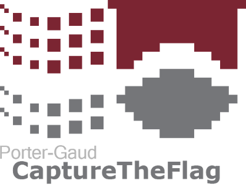

# Porter-Gaud CTF - Problem Set

---
Web problems (and Algo 1) were uploaded to a server using Docker in order to isolate them from each other, and were put on different network interfaces in order to give each problem a different IP address, rather than cluttering ports on one server.
We used the [Facebook Platform](https://github.com/facebook/fbctf) to host the scoreboard
---
Halfway through the competition, a server (10.10.1.77) was added to the scope with no description, but a corresponding flag in "Libya."  The server was loaded with an unpatched version of Windows XP vulnerable to [MS08-067](https://www.rapid7.com/db/modules/exploit/windows/smb/ms08_067_netapi), exploitable with [this Metasploit module](https://www.rapid7.com/db/modules/exploit/windows/smb/ms08_067_netapi).
---

### Algorithm
* Algo 1
* Algo 2

### Web
* Ecorp Internal
* The Jar
* Super Secure
* I CAN'T C
* MongoDB is web scale

### Forensics
* Hidden Encryption
* Stegosaurus
* Sample in a Jar
* The D in Detroit

### Cryptography
* Caesar
* Onion
* ADFGX

### Archlinux VM
* 1
* 2
* 3
* 4
* 5

### Misc.
* "Hack The ______!"
* Reverse Engineering
* Tillson Galloway Recon
* Charles Truluck Recon
